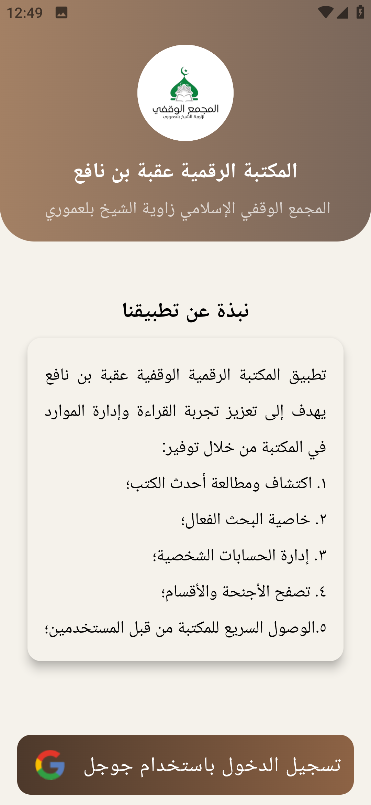
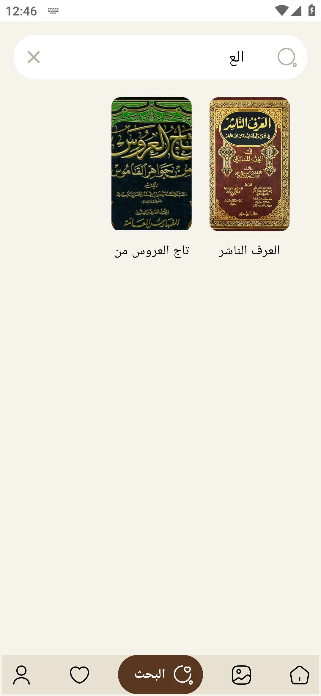
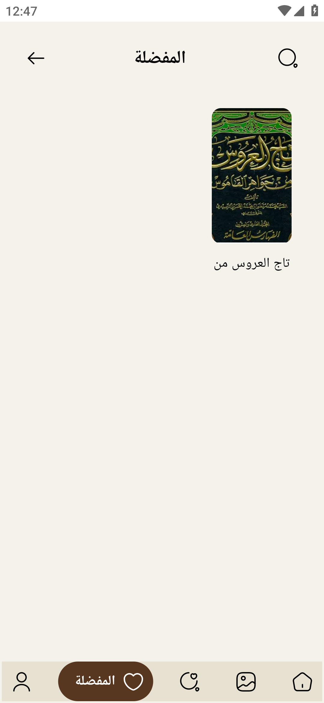
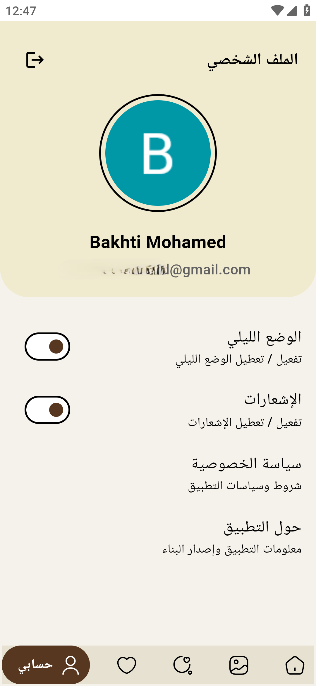

# Uqba-eLibrary 📚

The "Uqba ibn Nafi" Endowment Digital Library application, affiliated with the Zaouia of Sheikh Bel Amouri in Sidi Issa, aims to enhance the reading experience and manage resources in the library.

## Features ✨

- **Digital Collection**: Access a wide range of digital books and resources from the library.
- **User Authentication**: Secure login and registration using Firebase Authentication.
- **Book Management**: Add, update, and manage library resources easily.
- **Search Functionality**: Find books and resources quickly with a robust search feature.
- **Favorites**: Mark books and resources as favorites for easy access.
- **Photo Gallery**: View and manage images related to library resources.
- **Firebase Integration**: Manage user data, book collections, and more through Firebase Firestore.

## Screenshots 📱

<p float="left">
  
  
  
  
  
  
  
  
  
  
  
</p>

## Installation and Setup 🚀

1. Clone the repository:

   ```bash
   git clone https://github.com/yourusername/uqba-elibrary.git
   ```

2. Navigate to the project directory:

   ```bash
   cd uqba-elibrary
   ```

3. Install the necessary dependencies:

   ```bash
   flutter pub get
   ```

4. Configure Firebase for your project:

   - Follow the Firebase setup instructions to connect your app with Firebase.
   - Replace `google-services.json` in your Android project and `GoogleService-Info.plist` in your iOS project with your own.

5. Run the app:

   ```bash
   flutter run
   ```

## Technologies Used 🛠️

- **Flutter**: UI toolkit for building natively compiled applications.
- **GetX**: State management and dependency injection.
- **Firebase**: Backend as a service for authentication, Firestore, and more.
- **Firestore**: NoSQL cloud database to store and sync data in real-time.

## Future Enhancements 🔮

- **Dark Mode**: Switch between light and dark themes for a better reading experience.
- **Notifications**: Receive updates and notifications about library activities and new resources.

## Contributing 🤝

Contributions are welcome! If you have any ideas, suggestions, or issues, feel free to submit a pull request or open an issue.

---

Developed by **Bakhti Khaled** with ❤️ using Flutter and Firebase.
